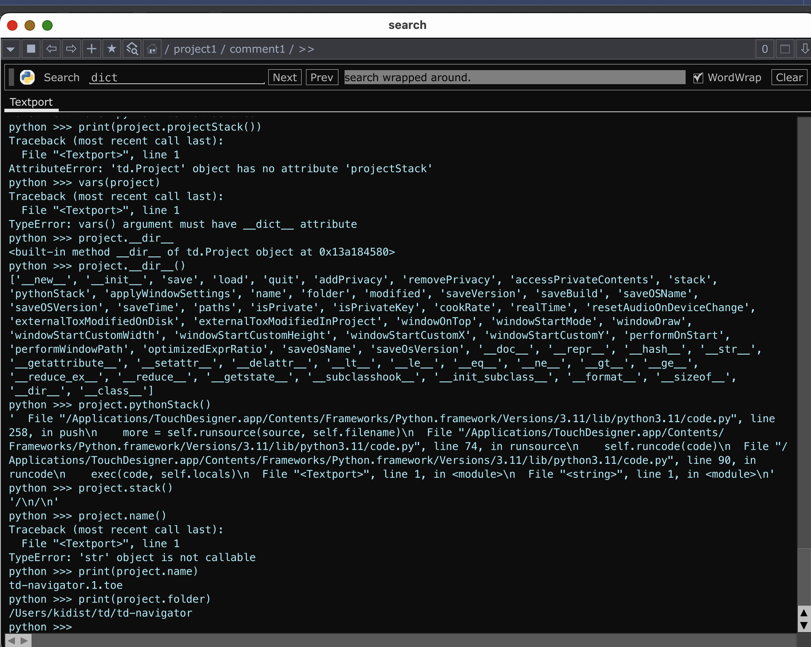
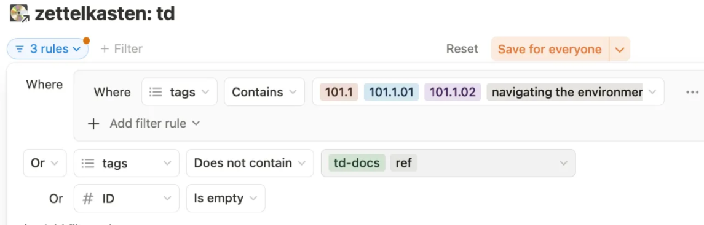

# day2

Date: May 30, 2025
morning pages: Yes

reading:

…

goals:

- [ ]  101.1.01
    - [x]  primary
    - [ ]  zettels
    - [ ]  resources
    - [ ]  exp + notes
- [ ]  101.1.02
    - [x]  primary
    - [ ]  zettels
    - [ ]  resources
    - [ ]  exp + notes
- [ ]  101.1.03
    - [x]  primary
    - [ ]  zettels
    - [ ]  resources
    - [ ]  exp + notes
- [ ]  setup curriculum navigator!
- [ ]  

notes: (reverse chronological order)

- analyzing the ‘project’ variable
    - `print(project.name)`
    - `print(project.folder)`
    - 
    
    
    
- using “me” object
    - ss
    - `me.__dir__()`
    
    ```python
    
    python >>> me.__dir__()
    ['__new__', '__init__', '__doc__', 'type', 'label', 'icon', 'family', 'OPType', 'opType', 'isFilter', 'isCustom', 'subType', 'minInputs', 'maxInputs', 'isMultiInputs', 'visibleLevel', 'supported', 'licenseType', 'vars', 'setVar', 'unsetVar', 'resetNetworkView', 'initializeExtensions', 'save', 'saveByteArray', 'loadByteArray', 'saveExternalTox', 'loadTox', 'reload', 'copy', 'copyOPs', 'collapseSelected', 'findChildren', 'create', 'addPrivacy', 'removePrivacy', 'accessPrivateContents', 'blockPrivateContents', 'appendCustomPage', 'sortCustomPages', 'destroyCustomPars', 'pickable', 'componentCloneImmune', 'inputCOMPConnectors', 'outputCOMPConnectors', 'inputCOMPs', 'outputCOMPs', 'currentChild', 'selectedChildren', 'extensions', 'extensionsReady', 'internalOPs', 'internalPars', 'clones', 'externalTimeStamp', 'dirty', 'isPrivate', 'isPrivacyActive', 'isPrivacyLicensed', 'privacyDeveloperName', 'privacyDeveloperEmail', 'privacyFirmCode', 'privacyProductCode', 'vfs', '__repr__', '__hash__', '__str__', '__getattribute__', '__setattr__', '__delattr__', '__lt__', '__le__', '__eq__', '__ne__', '__gt__', '__ge__', '__add__', '__radd__', '__mul__', '__rmul__', '__bool__', 'copyParameters', 'ops', 'setInputs', 'pars', 'parGroups', 'evalExpression', 'fetch', 'fetchOwner', 'store', 'unstore', 'storeStartupValue', 'unstoreStartupValue', 'cook', 'unload', 'changeType', 'destroy', 'relativePath', 'shortcutPath', 'resetNodeSize', 'openViewer', 'closeViewer', 'resetViewer', 'openParameters', 'openMenu', 'var', 'warnings', 'errors', 'scriptErrors', 'addScriptError', 'addError', 'addWarning', 'clearScriptErrors', 'resetPars', 'dependenciesTo', 'childrenCPUMemory', 'childrenGPUMemory', '__getstate__', '__setstate__', 'id', 'passive', 'op', 'parent', 'iop', 'ipar', 'valid', 'curPar', 'curBlock', 'curSeq', 'currentPage', 'name', 'path', 'digits', 'base', 'children', 'numChildren', 'recursiveChildren', 'numChildrenRecursive', 'time', 'color', 'storage', 'par', 'parGroup', 'seq', 'builtinPars', 'customPars', 'customPages', '_customPages', 'pages', '_pages', 'customTuplets', 'customParGroups', 'comment', 'tags', 'mod', 'warning', 'error', 'inputs', 'outputs', 'inputConnectors', 'outputConnectors', 'ext', 'replicator', 'filePath', 'fileFolder', 'nodeX', 'nodeY', 'nodeWidth', 'nodeHeight', 'nodeCenterX', 'nodeCenterY', 'dock', 'docked', 'display', 'render', 'viewer', 'activeViewer', 'lock', 'selected', 'python', 'current', 'bypass', 'expose', 'cloneImmune', 'showDocked', 'showCustomOnly', 'allowCooking', 'isCOMP', 'isBase', 'isObject', 'isPanel', 'isTOP', 'isCHOP', 'isSOP', 'isMAT', 'isDAT', 'totalCooks', 'cookFrame', 'cpuCookTime', 'gpuCookTime', 'cookAbsFrame', 'cookStartTime', 'cookEndTime', 'cookedThisFrame', 'cookedPreviousFrame', 'cpuMemory', 'gpuMemory', 'childrenCPUCookTime', 'childrenCPUCookAbsFrame', 'childrenGPUCookTime', 'childrenGPUCookAbsFrame', 'childrenCookTime', 'childrenCookAbsFrame', 'cookTime', '__reduce_ex__', '__reduce__', '__subclasshook__', '__init_subclass__', '__format__', '__sizeof__', '__dir__', '__class__']
    ```
    
    
    


- path for project1
    - /Users/kidist/Desktop/td/NewProject.10.toe
- downloaded
    - new stable release (try to fix ‘project1 issue)
        - [error window pic: ](../../The%20100%20Series%20TouchDesigner%20Fundamentals%201faa70bb517c8022bc4ad72d8186682d.md)
        
        2023.12370 - May 21, 2025 - [Release Notes](https://docs.derivative.ca/Release_Notes)
        
        - deleted touchdesigner release 2022 (dragged application (from folder) to trash & emptied trash)
        - new version
        
        
        

spent a lot of time just organizing

- uploaded scans of primary notes
- solidified db format
    - still needda figure out how to show just the related zettels
        - filter
            - 
        
        
        
        