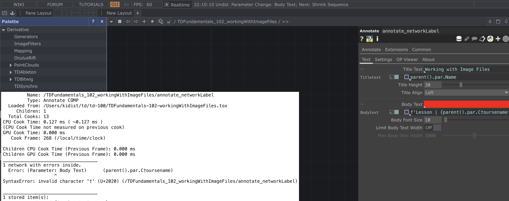

# day23

Date: June 20, 2025
Tags: python, week4
morning pages: No

reading:

goals:

notes:

python in touchdesigner

```python
// project stacktrace
print(project.pythonStack())

// print current dir
import os
os.getcwd()

// clear terminal
clear()

```

run python shell in mac terminal

```python
> python3

//opens shell / repl: read, eval, print, loop
>>>
```

debugging tip:



check red param in parameter dialog ( box on right) for invalid fields )

debugging opsnippets viewer


/Applications/TouchDesigner.app/Contents/Resources/tfs/Samples/Learn/OPSnippets/Snippets/TOP/addTOP.tox