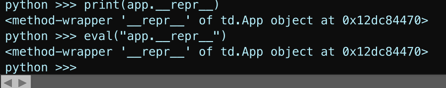

# day29

Date: June 26, 2025
Tags: debug, python, week5
morning pages: Yes

reading:

goals:

- [ ]  module 2: Working With TOPs (Images)
    - [ ]  102.01 : ww images
        - [ ]  wwimgs.tox
            
            `/kidist/td/td-100/td-102/TDFundamentals-102-WorkingWithImageFiles.tox` 
            
            jellybean image example:
            
            active viewer : `A`  or bottom right corner `+`  key
            
            `a` active viewer mode 
            
            `h` home
            
            `f` show field guidelines
            
            `c` color
            
            `r` red channel
            
            `g` green channel
            
            `b` blue channel
            
            `a` alpha channel
            
            `m` mono channel
            
            `n` normalized split
            
            `v` view as points
            
    - [ ]  102.02: ww videos
        - [ ]  wwvideofiles.tox
            
            `/kidist/td/td-100/td-102/TDFundamentals-102-WorkingWithVideoFiles.tox` 
            
            - `clear()` : clears the python terminal/ dialog window
            - `help(app)` : prints out the docstr for the object’s class
                
                ```powershell
                python >>> help(app)
                Help on App object:
                
                class App(builtins.object)
                 |  This class contains specific application details, such as its version and installation folders. It can be accessed with the app object, found in the automatically imported td module.
                 |  
                 |  NOTE: See also Variables and Dialogs -> Variables where more built-in paths and strings are available via expressions in the form var('DESKTOP'), var('MYDOCUMENTS') and var('TOENAME').
                 |  
                 |  Methods defined here:
                 |  
                 |  __init__(self, /, *args, **kwargs)
                 |      Initialize self.  See help(type(self)) for accurate signature.
                 |  
                 |  addNonCommercialLimit(...)
                 |      addNonCommercialLimit(password=None) -> None
                 |      Limits the application to operate at non-commercial license level. Multiple calls can be made, but each can be undone with a  matching removeNonCommercialLimit(password).  If the password is blank the operation cannot be undone. (See also licenses.disablePro) member.
                 |      
                 |      Args:
                 |              password - (Keyword, Optional) Password to later remove the restriction.
                 |      
                 |      Example:
                 |              app.addNonCommercialLimit(password='secret123')  #undoable with password
                 |              app.addNonCommercialLimit()  #permanent during length of session.
                 |  
                 |  addResolutionLimit(...)
                 |      addResolutionLimit(x, y, password=None) -> None
                 |      Limits all textures to the specified amount. Multiple calls can be made, but each can be undone with a  matching removeResolutionLimit(password).  The final resolution limit will be the minimum of all calls. If the password is blank the operation cannot be undone.
                 |      
                 |      Args:
                 |              x - Width of maximum texture resolution, measured in pixels.
                 |              y - Height of maximum texture resolution, measured in pixels.
                 |              password - (Keyword, Optional) Password to later remove the restriction.
                 |      
                 |      Example:
                 |              app.addResolutionLimit(600, 480, password='secret123')  #undoable with password
                 |              app.addResolutionLimit()  #permanent during length of session.
                 |  
                 |  removeNonCommercialLimit(...)
                 |      removeNonCommercialLimit(password=None) -> bool
                 |      Removes the restriction previously added. Returns True if successful.
                 |      
                 |      Args:
                 |              password - (Keyword) Password previously used when restriction added.
                 |      
                 |      Example:
                 |              app.removeNonCommercialLimit(password='secret123')
                 |  
                 |  removeResolutionLimit(...)
                 |      removeResolutionLimit(password=None) -> bool
                 |      Removes the restriction previously added. Returns True if successful.
                 |      
                 |      Args:
                 |              password - (Keyword) Password previously used when restriction added.
                 |      
                 |      Example:
                 |              app.removeResolutionLimit(password='secret123')
                 |  
                 |  ----------------------------------------------------------------------
                 |  Static methods defined here:
                 |  
                 |  __new__(*args, **kwargs) from builtins.type
                 |      Create and return a new object.  See help(type) for accurate signature.
                 |  
                 |  ----------------------------------------------------------------------
                 |  Data descriptors defined here:
                 |  
                 |  applicationsFolder
                 |      Return the primage location for installing applications on the system eg. 'C:/Program Files' on Windows.
                 |  
                 |  architecture
                 |      The architecture of the compile.  Generally 32 or 64 bit.
                 |  
                 |  binFolder
                 |      Installation folder containing the binaries.
                 |  
                 |  build
                 |      Application build number.
                 |  
                 |  compileDate
                 |      The date the application was compiled, expressed as a tuple (year, month, day).
                 |  
                 |  configFolder
                 |      Installation folder containing configuration files.
                 |  
                 |  desktopFolder
                 |      Current user's desktop folder.
                 |  
                 |  enableCachedParameters
                 |      Get or set caching parameter values instead of always evaluating.
                 |  
                 |  enableOptimizedExprs
                 |      Get or set if Python expression optimization is enabled. Defaults to True every time TouchDesigner starts.
                 |  
                 |  experimental
                 |      Returns true if the App is an experimental build, false otherwise.
                 |  
                 |  installFolder
                 |      Main installation folder.
                 |  
                 |  launchTime
                 |      Total time required to launch and begin playing the toe file, measured in seconds.
                 |  
                 |  logExtensionCompiles
                 |      Get or set if extra messages for starting and ending compiling extensions is sent to the textport. Additional error stack will be printed if compilation fails.  Defaults to False every time TouchDesigner starts.
                 |  
                 |  osName
                 |      The operating system name.
                 |  
                 |  osVersion
                 |      The operating system version.
                 |  
                 |  paletteFolder
                 |      Installation folder containing palette files.
                 |  
                 |  power
                 |      Get or set the overall processing state of the process. When True, processing is enabled.  When False processing is halted. This is identical to pressing the power button on the main interface. This has a greater effect than simply pausing or stopping the playbar.
                 |      
                 |      Example:
                 |              app.power = False #turn off the power button.
                 |  
                 |  preferencesFolder
                 |      Folder where the preferences file is located.
                 |  
                 |  processId
                 |      The ID of the current running process.
                 |  
                 |  product
                 |      Type of executable the project is running under. Values are 'TouchDesigner', 'TouchPlayer' or 'TouchEngine'.
                 |  
                 |  pythonExecutable
                 |      Path to TouchDesigner's Python executable. This executable is not used directly by TouchDesigner but can be used to test pure Python code in an environment with all the packages and modules included with TouchDesigner. The executable can also be used to run external Python scripts without installing a separate Python installation.
                 |  
                 |  recentFiles
                 |      Get or set the list of most recently saved or loaded files.
                 |  
                 |  samplesFolder
                 |      Installation folder containing configuration files.
                 |  
                 |  systemFolder
                 |      Installation folder containing system files.
                 |  
                 |  tempFolder
                 |      Folder used for temporary files.
                 |  
                 |  userPaletteFolder
                 |      Folder where custom user palettes are located.
                 |  
                 |  version
                 |      Application version number.
                 |  
                 |  windowColorBits
                 |      The number of color bits per color channel the TouchDesigner window is running at. By default this will be 8-bits per channel, but can be increased to 10-bits by settings env var TOUCH_10_BIT_COLOR=1. Only works on displays that support 10-bit color.
                python >>> 
                ```
                
            - learning to debug: printing attributes of an object
                - 
                - rabbit hole:
                    - import pprint fronm pprint; `pprint(vars(my_obj))`
                        
                        https://stackoverflow.com/questions/192109/is-there-a-built-in-function-to-print-all-the-current-properties-and-values-of-a
                        
                        first answer: 
                        
                        *use prettyprint module*
                        
                        > You want `vars()` mixed with `pprint()`:
                        > 
                        
                        ```python
                        from pprint import pprint
                        pprint(vars(your_object))
                        ```
                        
                        second answer:
                        
                        - *use dir, vars, functions or inspect module*
                            
                            > You are really mixing together two different things.
                            > 
                            > 
                            > Use [`dir()`](https://docs.python.org/3/library/functions.html#dir), [`vars()`](https://docs.python.org/3/library/functions.html#vars) or the [`inspect`](https://docs.python.org/3/library/inspect.html) module to get what you are interested in (I use `__builtins__` as an example; you can use any object instead).
                            > 
                            > - *print dict*
                            >     
                            >     ```python
                            >     >>> l = dir(__builtins__)
                            >     >>> d = __builtins__.__dict__
                            >     
                            >     ```
                            >     
                            > - *output*
                            >     
                            >     Print that dictionary however fancy you like:
                            >     
                            >     ```python
                            >     >>> print l
                            >     ['ArithmeticError', 'AssertionError', 'AttributeError',...
                            >     
                            >     ```
                            >     
                            > - *prettyprint and indents*
                            >     
                            >     or
                            >     
                            >     ```python
                            >     >>> from pprint import pprint
                            >     >>> pprint(l)
                            >     ['ArithmeticError',
                            >      'AssertionError',
                            >      'AttributeError',
                            >      'BaseException',
                            >      'DeprecationWarning',
                            >     ...
                            >     
                            >     >>> pprint(d, indent=2)
                            >     { 'ArithmeticError': <type 'exceptions.ArithmeticError'>,
                            >       'AssertionError': <type 'exceptions.AssertionError'>,
                            >       'AttributeError': <type 'exceptions.AttributeError'>,
                            >     ...
                            >       '_': [ 'ArithmeticError',
                            >              'AssertionError',
                            >              'AttributeError',
                            >              'BaseException',
                            >              'DeprecationWarning',
                            >     ...
                            >     
                            >     ```
                            >     
                        - *pdb: use python debugging module*
                            
                            > Pretty printing is also available in the interactive debugger as a command:
                            > 
                            > - *interactive debug mode*
                            >     
                            >     ```python
                            >     (Pdb) pp vars()
                            >     {'__builtins__': {'ArithmeticError': <type 'exceptions.ArithmeticError'>,
                            >                       'AssertionError': <type 'exceptions.AssertionError'>,
                            >                       'AttributeError': <type 'exceptions.AttributeError'>,
                            >                       'BaseException': <type 'exceptions.BaseException'>,
                            >                       'BufferError': <type 'exceptions.BufferError'>,
                            >                       ...
                            >                       'zip': <built-in function zip>},
                            >      '__file__': 'pass.py',
                            >      '__name__': '__main__'}
                            >     
                            >     ```
                            >     
                            >     e[dited May 4, 2017 at 14:04](https://stackoverflow.com/posts/192365/revisions)
                            >     
                            >     answered Oct 10, 2008 at 17:27
                            >     
                            >     user3850
                            >     
                        
                        k
                        
                    - vars()
                        
                        https://docs.python.org/3/library/functions.html#vars
                        
                    - debugging mode
                        
                        https://docs.python.org/3/library/pdb.html
                        
                        - example:
                            
                            ```powershell
                            python >>> from pprint import pprint
                            python >>> pprint(app)
                            <td.App object at 0x12dc84470>
                            python >>> l = dir(app)
                            python >>> pprint(l)
                            ['__class__',
                             '__delattr__',
                             '__dir__',
                             '__doc__',
                             '__eq__',
                             '__format__',
                             '__ge__',
                             '__getattribute__',
                             '__getstate__',
                             '__gt__',
                             '__hash__',
                             '__init__',
                             '__init_subclass__',
                             '__le__',
                             '__lt__',
                             '__ne__',
                             '__new__',
                             '__reduce__',
                             '__reduce_ex__',
                             '__repr__',
                             '__setattr__',
                             '__sizeof__',
                             '__str__',
                             '__subclasshook__',
                             'addNonCommercialLimit',
                             'addResolutionLimit',
                             'applicationsFolder',
                             'architecture',
                             'binFolder',
                             'build',
                             'compileDate',
                             'configFolder',
                             'desktopFolder',
                             'enableCachedParameters',
                             'enableOptimizedExprs',
                             'experimental',
                             'installFolder',
                             'launchTime',
                             'logExtensionCompiles',
                             'osName',
                             'osVersion',
                             'paletteFolder',
                             'power',
                             'preferencesFolder',
                             'processId',
                             'product',
                             'pythonExecutable',
                             'recentFiles',
                             'removeNonCommercialLimit',
                             'removeResolutionLimit',
                             'samplesFolder',
                             'systemFolder',
                             'tempFolder',
                             'userPaletteFolder',
                             'version',
                             'windowColorBits']
                            python >>> app.__dict__
                            Traceback (most recent call last):
                              File "<Textport>", line 1
                            AttributeError: 'td.App' object has no attribute '__dict__'
                            python >>> v1 = "osName"
                            python >>> v2 = "installFolder"
                            python >>> print(f"OS Name: {v1}, Install Folder: {v2}")
                            OS Name: osName, Install Folder: installFolder
                            python >>> print(f"OS Name: {app.v1}, Install Folder: {app.v2}")
                            Traceback (most recent call last):
                              File "<Textport>", line 1
                            AttributeError: 'td.App' object has no attribute 'v1'
                            python >>> print(f"OS Name: {app.osName}, Install Folder: {app.installFolder}")
                            OS Name: macOS, Install Folder: /Applications/TouchDesigner.app
                            python >>> 
                            ```
                            
                            - 
                        - ^ notes:
                            - call dict() function on an instance of an object (in ths example *app)*  to generate a dictionary of said object where
                                - key: attribute
                                - value: value of attribute stored in the object’s instance
                            - note, .__dict__ is not callable because the object hasn’t defined this attribute specifically in its implementation
                                - as you can see…  `AttributeeError: 'td.App' has no attribute '__dict_'`
                            - method wrappers….
                                - [trying to print the string representation of the “app” instance of the “App” object](day29%2021ea70bb517c8050935fc64fbea79ff1.md)
                    - method wrappers
                        - trying to print the string representation of the “app” instance of the “App” object
                            
                            
                            
                            - s
                        - https://www.geeksforgeeks.org/python/function-wrappers-in-python/#
                            - function wrappers aka = “decorators”
                                - you can create a decorator or a wrapper that calls another function (without modifying that function’s code) and modfy the output of that called function inside the wrapper function / decoratort
                                - ex
                                    - 
                        
                - 
            
    - [ ]  
    - [ ]  102.03:

notes: